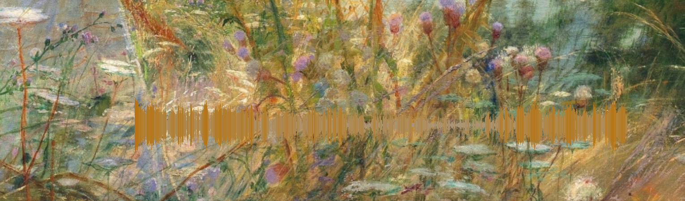

# Lavoe_Salsa

> *"Yo soy el cantante que muy bien lo han vivido..."*

**🇧🇷 Português** | [🇪🇸 Español](#español) | [🇬🇧 English](#english)

<p align="center">
  <a href="https://opensource.org/licenses/MIT"></a>
  <a href="https://isocpp.org/"></a>
  <a href="https://www.lua.org/"></a>
  <a href="https://www.kernel.org/"></a>
</p>

<p align="center">
  <strong>Stack / Núcleo</strong><br/>
  <a href="https://www.freedesktop.org/wiki/Software/PulseAudio/"></a>
  <a href="https://www.fftw.org/"></a>
  <a href="https://cmake.org/"></a>
  <a href="https://www.x.org/"></a>
</p>

<p align="center">
  <strong>Bindings &amp; Tooling Python</strong><br/>
  <a href="https://pybind11.readthedocs.io/"></a>
  <a href="https://www.python.org/"></a>
  <a href="https://numpy.org/"></a>
  <a href="https://matplotlib.org/"></a>
</p>

Visualizador de áudio em overlay sobre o wallpaper do desktop Linux, escrito
em **C++20 + Lua 5.4** — uma homenagem a **Héctor Lavoe** (1946–1993),
"El Cantante", uma das grandes vozes que popularizaram a Salsa e demais
tradições rítmicas da América Latina e Caribe no Planeta Terra.

<p align="center">
  
</p>
<p align="center"><em>Modo waveform (ruído rosa) desenhado sobre o wallpaper — também há modo de barras de espectro.</em></p>

---

## Português

### Conceito

Lavoe Salsa é o sucessor espiritual do [glava](https://github.com/jarcode-foss/glava):
em vez de um programa de visualização qualquer, ele desenha o espectro do
áudio **diretamente sobre o papel de parede**, como se fosse parte do desktop.
Barras finas e elegantes dançando na base da tela enquanto você escuta salsa
(no ytm-player, no mpv, no navegador — tanto faz: o áudio do **sistema
inteiro** é capturado).

Foi escrito **do zero** em C++20 moderno, com:

- captura do **monitor do sink padrão** do PipeWire/PulseAudio (funciona com
  qualquer player, sem plugins nem loopbacks manuais);
- DSP com FFT (FFTW, single precision) e suavização estilo cava;
- overlay ARGB verdadeiro via **X11 + XRender** — fundo 100% transparente,
  estados `_NET_WM_STATE` (STICKY + BELOW + SKIP_TASKBAR + SKIP_PAGER), fica
  acima do wallpaper e abaixo das janelas, em todos os workspaces;
- configuração em **Lua 5.4** (`~/.config/lavoe-salsa/config.lua`), com
  gradiente configurável e função `bar_color(i, nivel, t)` opcional para
  scriptar cores por frame.

**Transparência:** este projeto *não* é um fork do glava nem de nenhum outro
visualizador — só compartilha a ideia. Todo o código é original.

### Requisitos

`g++` (C++20), `cmake` ≥ 3.20, `libpulse-dev`, `libfftw3-dev`,
`liblua5.4-dev`, `libx11-dev`, `libxrender-dev`, `libxext-dev`. Opcionais:
`pybind11-dev`, `python3-dev`, `python3-numpy` (bindings),
`python3-matplotlib` (ferramenta de plot).

Recomendado: desktop com compositor ativo (Cinnamon/muffin, KDE/KWin etc.)
para a transparência ARGB funcionar.

### Build

```bash
cmake -B build
cmake --build build -j
```

O binário sai em `build/lavoe-salsa`.

### Uso

```bash
./build/lavoe-salsa            # overlay na base do monitor esquerdo
./build/lavoe-salsa --help
./build/lavoe-salsa --version
./build/lavoe-salsa --config /caminho/outro.lua
./build/lavoe-salsa --dump     # CSV das alturas das barras por frame
```

Na primeira execução, `~/.config/lavoe-salsa/config.lua` é gerado com todos
os padrões comentados. Teste o áudio com qualquer player:

```bash
speaker-test -c 2 -t wav -l 1 -D pulse
```

### Configuração (Lua)

Veja o template completo comentado em [`config/lavoe.lua`](config/lavoe.lua).
Destaques:

```lua
return {
    geometry = { monitor = 0, w = 1100, h = 280, margem_base = 70 },
    mode = "bars",  -- "bars" (espectro) ou "waveform" (forma de onda, estilo DAW)
    barras = 56,
    largura_barra = 6,   -- barras finas, estilo medidor
    espacamento   = 3,
    fps = 60,
    gradiente = {
        { 0.00, "#a89984" },  -- cinza-areia (Gruvbox)
        { 0.35, "#b57614" },  -- mostarda
        { 0.70, "#d65d0e" },  -- laranja queimado
        { 1.00, "#cc241d" },  -- vermelho
    },
    suavizacao = { ataque = 0.65, queda = 0.18, piso_ruido = 0.02 },
    -- waveform: ganho, espelhamento no eixo central e cor do eixo
    waveform_scale = 1.0, waveform_mirror = true, axis_color = "#d5c4a1",
    -- cores por barra via Lua (prioridade sobre o gradiente; funciona
    -- nos dois modos — recebe o indice da coluna/barra):
    -- bar_color = function(i, nivel, t) return {r=, g=, b=} end,
}
```

No modo `"waveform"` o desenho é uma forma de onda em domínio do tempo
(estilo osciloscópio, inspirada na waveform do Ardour): cada coluna de 1px
da janela recebe um segmento vertical espelhado em torno do eixo central,
com altura proporcional ao pico da amplitude; a cor segue o gradiente por
amplitude.

### Ferramentas

```bash
# plota o espectro a partir do --dump (ferramenta de dev)
lavoe-salsa --dump | python3 tools/plot_spectrum.py
```

### Limitações conhecidas

- Só funciona em X11 (usa XRender diretamente); Wayland fica para o futuro.
- A captura segue o **sink padrão**; mudanças são detectadas em runtime.
- A geometria dos monitores é obtida via Xinerama (dlopen) ou `xrandr`.

### Licença

[MIT](LICENSE) — © 2026 Luiz Paulo Colombiano.

---

## Español

### Concepto

Lavoe Salsa es el sucesor espiritual de
[glava](https://github.com/jarcode-foss/glava): en lugar de un visualizador
cualquiera, dibuja el espectro del audio **directamente sobre el fondo de
pantalla**, como si fuera parte del escritorio. Barras finas y elegantes
bailando al pie de la pantalla mientras suena salsa (en ytm-player, mpv, el
navegador — da igual: se captura el audio de **todo el sistema**).

Escrito **desde cero** en C++20 moderno:

- captura del **monitor del sink predeterminado** de PipeWire/PulseAudio
  (funciona con cualquier reproductor, sin plugins ni loopbacks);
- DSP con FFT (FFTW, precisión single) y suavizado estilo cava;
- overlay ARGB real con **X11 + XRender** — fondo 100% transparente,
  estados `_NET_WM_STATE` (STICKY + BELOW + SKIP_TASKBAR + SKIP_PAGER);
- configuración en **Lua 5.4** (`~/.config/lavoe-salsa/config.lua`), con
  degradado configurable y función opcional `bar_color(i, nivel, t)`.

**Transparencia:** este proyecto *no* es un fork de glava ni de ningún otro
visualizador — solo comparte la idea. Todo el código es original.

### Requisitos y compilación

`g++` (C++20), `cmake` ≥ 3.20, `libpulse-dev`, `libfftw3-dev`,
`liblua5.4-dev`, `libx11-dev`, `libxrender-dev`, `libxext-dev`.
Recomendado: escritorio con compositor activo (Cinnamon/muffin, KDE/KWin).

```bash
cmake -B build
cmake --build build -j
./build/lavoe-salsa --help
```

En el primer arranque se genera `~/.config/lavoe-salsa/config.lua` con todos
los valores por defecto comentados. Prueba el audio con cualquier reproductor:

```bash
speaker-test -c 2 -t wav -l 1 -D pulse
```

Además del espectro de barras (`mode = "bars"`, valor por defecto), hay un
modo **waveform** (`mode = "waveform"`): forma de onda en dominio del
tiempo, estilo osciloscopio/DAW — cada columna de 1px dibuja un segmento
vertical espejado alrededor del eje central, con la cor del gradiente por
amplitud (opciones: `waveform_scale`, `waveform_mirror`, `axis_color`).

### Limitaciones conocidas

- Solo funciona en X11 (usa XRender directamente); Wayland queda para el futuro.
- La captura sigue el **sink predeterminado**; los cambios se detectan en
  runtime.
- La geometría de los monitores se obtiene vía Xinerama (dlopen) o `xrandr`.

### Licença

[MIT](LICENSE) — © 2026 Luiz Paulo Colombiano.

---

## English

### Concept

Lavoe Salsa is the spiritual successor to
[glava](https://github.com/jarcode-foss/glava): instead of a standalone
visualizer window, it draws the audio spectrum **right on top of the desktop
wallpaper**, as if it were part of the desktop itself. Thin, elegant bars
dancing at the bottom of the screen while salsa plays (in ytm-player, mpv,
the browser — whatever: it captures **the whole system's** audio).

Written **from scratch** in modern C++20:

- captures the **monitor of the default PulseAudio/PipeWire sink** (works
  with any player — no plugins, no manual loopbacks);
- DSP with FFT (FFTW, single precision) and cava-style smoothing;
- true ARGB overlay via **X11 + XRender** — fully transparent background,
  `_NET_WM_STATE` (STICKY + BELOW + SKIP_TASKBAR + SKIP_PAGER) window states;
- **Lua 5.4** configuration (`~/.config/lavoe-salsa/config.lua`) with a
  configurable gradient and an optional `bar_color(i, level, t)` hook.

**Full disclosure:** this project is *not* a fork of glava or any other
visualizer — it only shares the idea. All code is original.

### Requirements and build

`g++` (C++20), `cmake` ≥ 3.20, `libpulse-dev`, `libfftw3-dev`,
`liblua5.4-dev`, `libx11-dev`, `libxrender-dev`, `libxext-dev`.
A composited desktop (Cinnamon/muffin, KDE/KWin, ...) is recommended for
ARGB transparency.

```bash
cmake -B build
cmake --build build -j
./build/lavoe-salsa --help
```

On first run, `~/.config/lavoe-salsa/config.lua` is generated with every
default commented out. Test the audio with any player:

```bash
speaker-test -c 2 -t wav -l 1 -D pulse
```

Besides the bar spectrum (`mode = "bars"`, the default), there is a
**waveform** mode (`mode = "waveform"`): a time-domain oscilloscope/DAW-style
waveform — each 1px column draws a vertical segment mirrored around the
center axis, colored by amplitude via the gradient (options:
`waveform_scale`, `waveform_mirror`, `axis_color`).

### Known limitations

- X11 only (uses XRender directly); Wayland support is future work.
- Capture follows the **default sink**; runtime changes are detected.
- Monitor geometry comes from Xinerama (dlopen) or `xrandr`.

### License

[MIT](LICENSE) — © 2026 Luiz Paulo Colombiano.

---

*Que viva la salsa, y que viva Héctor Lavoe.*
